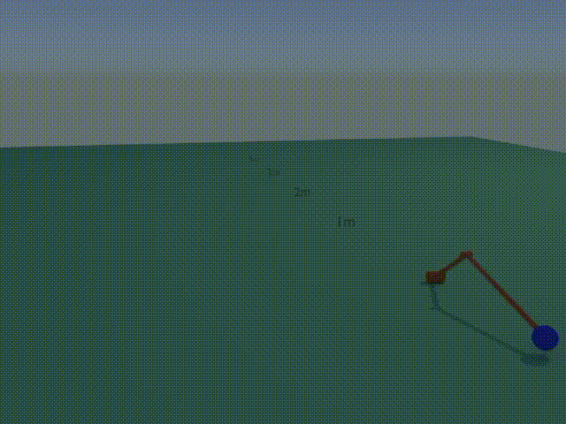

# ttk4195-robot-pitching

This repository contains code for simulating and controlling a ball-throwing robot.

## Goal
Design a controller which can throw the ball furthest without breaking constraints on robot motion.

## Results
The robot controller is a combination of a PD controller following a desired path. The desired path is parametrized as a third degree polynomial. No good strategy for finding a polynomial was used, but since the parameter space was small and it was quite clear in what order of magnitude the numbers would be, I just used a random search. 

